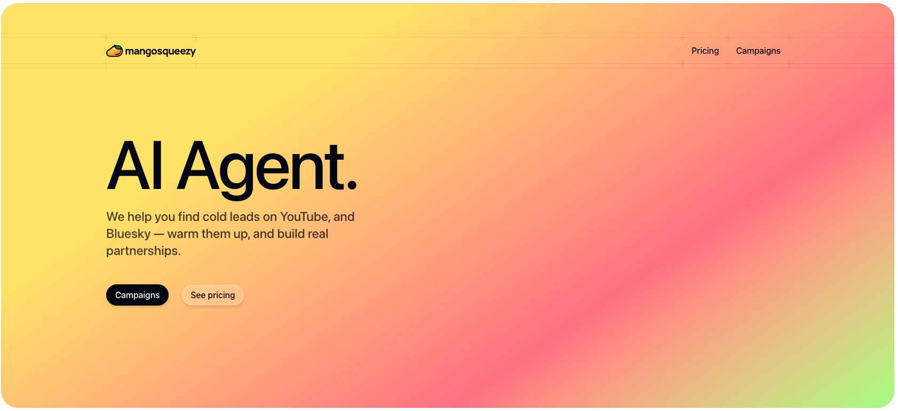

	<h1 align="center"><b>Mango Squeezy</b></h1>

    Affiliate marketing platform
     
     
    <a href="https://mangosqueezy.com">Website</a>
  

# Under active development

> The project is currently under development and is not ready to use yet.

# Get started

We are working on the documentation to get started with mangosqueezy for local development: work in progress 🚧

# App Architecture

- pnpm
- React
- TypeScript
- Nextjs
- Supabase
- Shadcn
- Aceternity
- TailwindCSS

### Hosting

- Supabase (database, storage, realtime, auth)
- Vercel (Website, edge-config, and metrics)

### Services

- Resend (email)
- Github Actions (CI/CD)
- Loops (Marketing email)
- Posthog (Events and Analytics)
- Dub (Short URLs)

## Repo Activity

